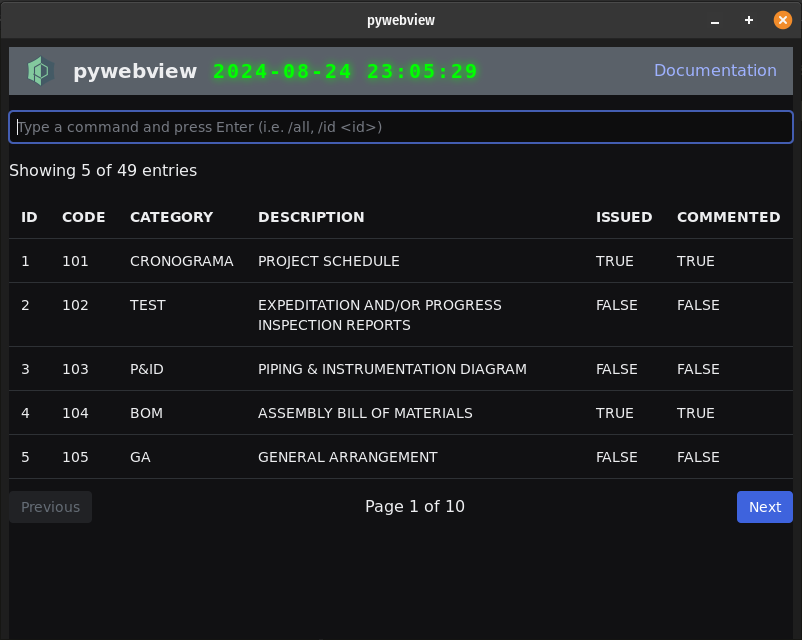

Note: forked from https://github.com/ShijiMi-Soup/pywebview-with-vite-react
(With JavaScript instead of TypeScript)

# Pywebview with Vite React

This is a  simple boilerplate to help you start with _pywebview_, Vite, and React.
Stack is based on pywebview, React, Vite bundler, pyinstaller (Windows/Linux) and py2app (macOS).



## Requirements
- Python 3
- Node

## Tutorials

- English: https://medium.com/@takahiro.zt899/creating-a-desktop-app-with-pywebview-vite-and-react-7785db86490f
- Japanese: https://qiita.com/ShijiMi-Soup/items/1f5e2b542884ca4a279f

## Initialization

```shell
npm run init
npm run start
npm run clean
```

### MAC OS

- MAC OS support was not tested but you can mimic the [original boiller plate](https://github.com/r0x0r/pywebview-react-boilerplate)

## Run in dev mode

### Only the frontend

```shell
npm run dev
```

### Build the frontend and run the backend in dev mode

```shell
npm run start
```

## Build

```shell
npm run build
```

## License

This project is licensed under the BSD 3-Clause License. See the [LICENSE](./LICENSE) file for more details.

### Third-Party Code

This project includes code from a project by Roman, used under the BSD 3-Clause License. See the [LICENSE-Roman](./LICENSE-Roman) file for more details.
